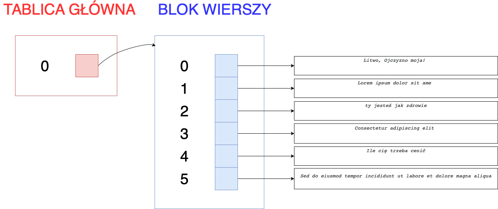

# Zarządzanie pamięcią, biblioteki, pomiar czasu 

## Zadanie 1. Alokacja tablicy ze wskaźnikami na bloki pamięci zawierające  tablicę wskaźników (25%)

Zaprojektuj i przygotuj zestaw funkcji (bibliotekę) do zarządzania tablicą bloków, w których to blokach pamięci zapisywane są rezultaty operacji porównywania mergowania dwóch plików wiersz po wierszu (round robin: 1 wiersz pliku A, 1 wiersz pliku B itd.) sekwencji par plików  — sekwencja ich nazw jest parametrem funkcji.

**Biblioteka powinna umożliwiać**:  
  

* Utworzenie tablicy wskaźników (tablicy głównej) — w tej tablicy będą przechowywane wskaźniki na wiersze zmergowanych plików — pierwszy element tablicy głównej zawiera wykaz wierszy pierwszej pary zmergowanych plików, drugi element dla drugiej pary, itd. Pojedynczy blok wierszy (element wskazywany z tablicy głównej), to tablica wskaźników na poszczególne wiersze w zmergowanym pliku
*Definiowanie sekwencji par plików
*Przeprowadzenie zmergowania (dla każdego elementu sekwencji) oraz zapisanie wyniku zmergowania do pliku tymczasowego
*Utworzenie, na podstawie zawartość pliku tymczasowego, bloku wierszy — tablicy wskaźników na wiersze, ustawienie w tablicy głównej (wskaźników) wskazania na ten blok; na końcu, funkcja powinna zwrócić indeks elementu tablicy (głównej), który zawiera wskazanie na utworzony blok
*Zwrócenie informacji o ilości wierszy w danym bloku wierszy
*Usunięcie, z pamięci, bloku (wierszy) o zadanym indeksie
*Usunięcie, z pamięci, określonego wiersza dla podanego bloku wierszy
*Wypisanie zmergowanych plików, z uwzględnieniem wcześniejszych usuniętych bloków wierszy / wierszy

**Przykład** — załóżmy, że sekwencja nazw plików zawiera tylko jedną parę ('a.txt', 'b.txt').

Zawartość pliku a.txt:

_Litwo, Ojczyzno moja!_

_ty jesteś jak zdrowie_

_Ile cię trzeba cenić_

Zawartość pliku b.txt:  
_Lorem ipsum dolor sit ame_ 

_Consectetur adipiscing elit_

_Sed do eiusmod tempor incididunt ut labore et dolore magna aliqua_

Wynik wykonania zmergowania plików a.txt i b.txt

_Litwo, Ojczyzno moja!_   
_Lorem ipsum dolor sit ame_   
_ty jesteś jak zdrowie_  
_Consectetur adipiscing elit_   
_Ile cię trzeba cenić_  
_Sed do eiusmod tempor incididunt ut labore et dolore magna aliqua_  

W tym przypadku tablica główna powinna zawierać tylko jeden wskaźnik na  blok wierszy (bo mamy tylko jedną parę plików).  Blok wierszy powinien być sześcioelementową tablicą wskaźników na napisy z treścią wierszy.

Tablice / bloki powinny być alokowane przy pomocy funkcji calloc() (alokacja dynamiczna).

Przygotuj plik _Makefile_, zawierający polecenia kompilujące pliki źródłowe biblioteki oraz tworzące biblioteki w dwóch wersjach: statyczną i współdzieloną.

## Zadanie 2. Program korzystający z biblioteki (25%)
Napisz program testujący działanie funkcji z biblioteki z zadania 1.

Jako argumenty przekaż liczbę elementów tablicy głównej (liczbę par plików) oraz listę zadań do wykonania. Zadania mogą stanowić zadania porównania wszystkich par w sekwencji lub zadania usunięcia bloku o podanym indeksie bądź usunięcia operacji o podanym indeksie.

Operacje mogą być specyfikowane w linii poleceń na przykład jak poniżej:

* create_table rozmiar — stworzenie tablicy o rozmiarze "rozmiar"
*merge_files file1A.txt:file1B.txt file2A.txt:file2B.txt … — zmergowanie pary plików:  file1A.txt z file1B.txt, file2A.txt z file2B.txt, itd
*remove_block index — usuń z tablicy bloków o indeksie index
*remove_row block_index row_index — usuń z bloku o indeksie block_index wiersz o indeksie row_index  

Program powinien stworzyć tablice bloków o zadanej liczbie elementów

W programie zmierz, wypisz na konsolę i zapisz  do pliku z raportem  czasy realizacji podstawowych operacji:

Przeprowadzenie zmergowanie par plików — różna ilość elementów w sekwencji par (mała (np. 1-5), średnia oraz duża ilość par) oraz różny stopień wielkości wierszy w plikach w parze (pliki z dużą ilością wierszy, pliki ze średnią ilością wierszy, pliki ze małą ilością wierszy)
Zapisanie, w pamięci, bloków o różnych rozmiarach (odpowiadających rozmiarom różnych przeprowadzonych mergy)
Usunięcie zaalokowanych bloków o różnych rozmiarach  (odpowiadających rozmiarom różnych przeprowadzonych mergy)
Na przemian  kilkakrotne dodanie i usunięcie zadanej liczby bloków 
Mierząc czasy poszczególnych operacji, zapisz trzy wartości: czas rzeczywisty, czas użytkownika i czas systemowy. Rezultaty umieść pliku raport2.txt i dołącz do archiwum zadania.

## Zadanie 3. Testy i pomiary (50%)
a. (25%) Przygotuj plik Makefile, zawierający polecenie uruchamiania testów oraz polecenia kompilacji programu z zad 2 na trzy sposoby:  
* Z wykorzystaniem bibliotek statycznych,
*Z wykorzystaniem bibliotek dzielonych (dynamiczne, ładowane przy uruchomieniu programu),
*Z wykorzystaniem bibliotek ładowanych dynamicznie (dynamiczne, ładowane przez program).
Wyniki pomiarów zbierz w pliku results3a.txt. Otrzymane wyniki krótko skomentuj.  

b.(25%) Rozszerz plik Makefile z punktu 3a) dodając możliwość skompilowania programu na trzech różnych  poziomach optymalizacji — -O0…-Os. Przeprowadź ponownie pomiary, kompilując i uruchamiając program dla różnych poziomów optymalizacji.

Wyniki pomiarów dodaj do pliku results3b.txt. Otrzymane wyniki krótko skomentuj.

Wygenerowane pliki z raportami załącz jako element rozwiązania.

**Uwaga**: Do odczytania pliku można użyć funkcji read() (man read), do wywołania zewnętrznego polecenia Unixa można użyć funkcji system() (man system).